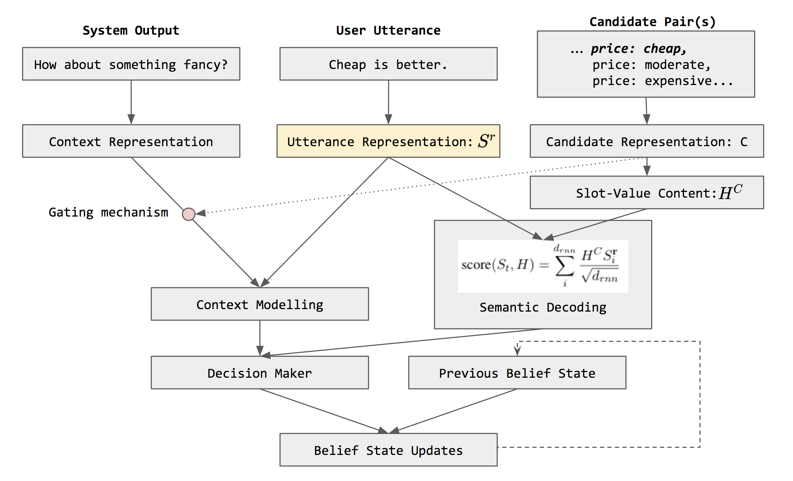

# Baby Jarvis

## Overview
Task-oriented dialogue systems have seen a recent boom, especially due to the advent and popularity of virtual assistants like Alexa and the Google Assistant. One of the core components of these modern dialogue systems is the belief tracker, which approximates the user's goal at each step in the conversation. There has been a significant amount of work done to design these state trackers, like an End-to-End Trainable Task-Oriented Dialogue System or a more recent model like the Neural Belief Tracker. In this project we propose an improvement using Bidirectional LSTM and Attention over the existing architecture to create NBT-BiLA.

## Running things
This repo provides "train.sh", "track.sh", "test.sh". TO train, test or test a model as well as to run a live interrface with a back and forth with the model.
The files in "config/" define all the hyper parameters for training and testing the model.

## Other resources
https://divye02.github.io/baby-jarvis

## Note
If you use this work, please cite this Github repo.
